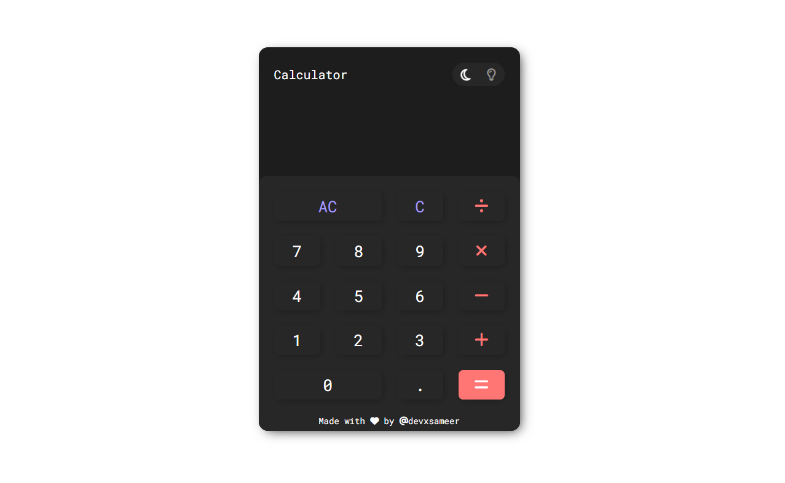

# 🧮 Odin Calculator

A sleek and functional calculator built using **HTML**, **CSS**, and **JavaScript** as part of [The Odin Project](https://www.theodinproject.com/) Foundations curriculum.  

This calculator performs basic arithmetic operations and features both **light** and **dark** mode themes for a clean and customizable user experience. 🌗

---

## 🚀 Features

- ➕ Basic operations: add, subtract, multiply, divide
- 🧠 Handles floating point numbers and chained operations
- 🌓 Toggle between **Dark Mode** and **Light Mode**
- 🧼 Clear and delete buttons
- 🖱️ Fully responsive layout (works on desktop & mobile)
- 🎨 Simple and intuitive user interface

---

## 🛠 Tech Stack

- **HTML** – Structure of the calculator
- **CSS** – Layout, design, and dark/light theme styling
- **JavaScript** – Logic for all operations and interaction

---

## 📸 Preview

---

## 🧠 What I Learned

- DOM manipulation and event handling in JavaScript
- Creating modular and reusable functions
- CSS theming (light/dark mode) with class toggling
- Responsive design with Flexbox

---

## 📂 Project Status

✅ Complete — but open to adding more features like keyboard support in the future!

---

## 🔗 Live Demo

[Click Here](https://devxsameer.github.io/odin-calculator/)

---

## 🙌 Try It Out!

Make some calculations — now in your preferred theme! 😄
